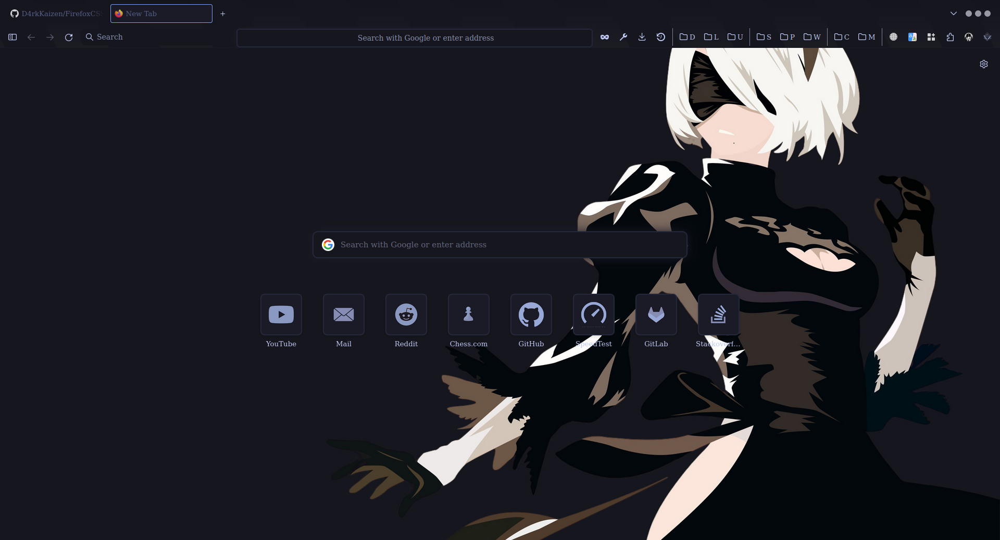
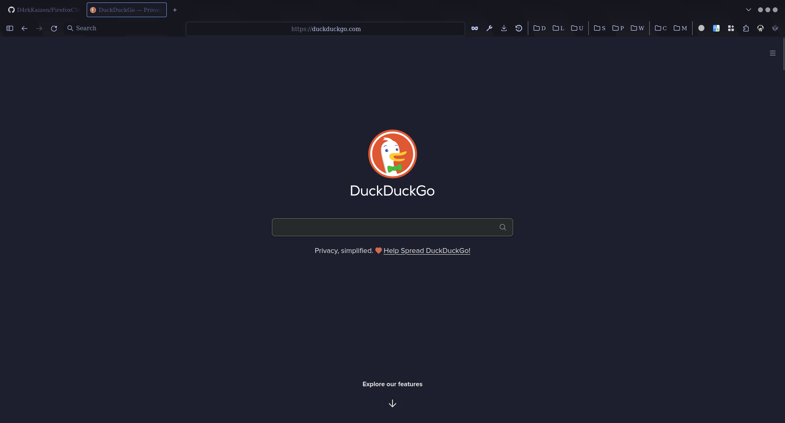
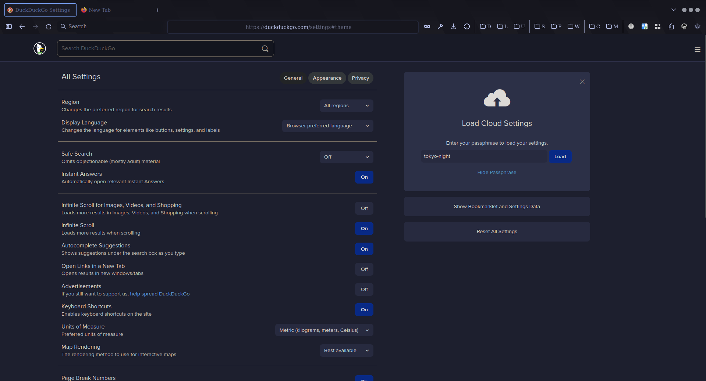

<h1>- Firefox CSS -</h1>
Custom Tokyo Night CSS for Firefox

# Tokyo Night

## Installation

1. Go to *`about:config`* and enable *`toolkit.legacyUserProfileCustomizations.stylesheets`*.

2. Locate your profile location by going to *`about:support`* and clicking *`Open Directory`* in *`Profile folder`* (Usually ends with *`.default-release`*)

3. Clone this repository by running `git clone https://github.com/D4rkKaizen/FirefoxCSS-TokyoNight`.

4. Paste the `chrome` folder into the correct profile folder.
    
6. 
### Linux:
Paste the contents of the `font` directory into your `~/.local/share/fonts` directory.

### Windows
Just install font by click right mouse button and then press "install"

## Font: https://www.nerdfonts.com/font-downloads

## Note:
- **For tokyo-night-fox css:**
I highly recommend installing this firefox theme: [`https://addons.mozilla.org/en-US/firefox/addon/tokyo-night-milav/`](https://addons.mozilla.org/en-US/firefox/addon/tokyo-night-milav/) and the JetBrains Mono Nerd font

 ## DuckDuckGo

Want to get this DuckDuckGo theme? Go to [`https://duckduckgo.com/settings#theme`](https://duckduckgo.com/settings#theme) and enter the passphrase **`tokyo-night`**.

